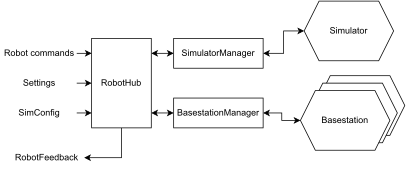
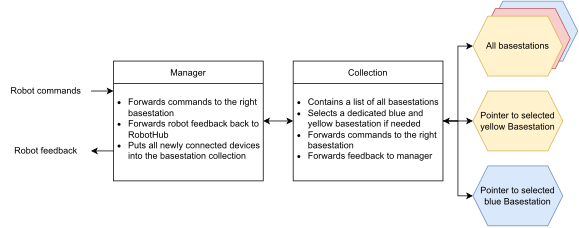

# Roboteam_robothub

* [What is RobotHub?](https://github.com/RoboTeamTwente/roboteam_robothub/tree/chore/improveDocumentation#what-is-robothub)
* [Installation](https://github.com/RoboTeamTwente/roboteam_robothub/tree/chore/improveDocumentation#installation)
* [Code architecture](https://github.com/RoboTeamTwente/roboteam_robothub/tree/chore/improveDocumentation#code-architecture)

## What is RobotHub?

Robothub is the interface between us and all robots, be it from the simulator or in real life. It forwards all commands we have to the right robot, and retrieves all the feedback it receives and publishes it.

## Installation

You do not really install RobotHub, but running RobotHub does have some requirements: Joining the dialout group and add permissions for basestation devices

### Joining the dialout group
On vanilla Ubuntu you are only allowed to use the serial port if you are in the dialout group, or something similar. However, by default this is not true. You need to add yourself to the dialout group (or if that doesn't work, google a bit for a similar solution. For arch this group is called uucp instead).

    
`sudo adduser $USER dialout`

This command and a reboot should settle it.

(It also might not. Just keep googling and restarting until you find the right command 😅)

### Adding permissions
For linux users, place the file [`99-platformio-udev.rules`](https://docs.platformio.org/en/latest/faq.html#platformio-udev-rules) in the folder `/etc/udev/rules.d`, and reboot your pc. This will give RobotHub the right permissions to open a connection to the basestation (specifically, USB devices with vendorId 0483). Note that this has nothing to do with Platformio in particular. It's just that this file provided by Platformio does the job.

## Code architecture

To keep things clear, the entrypoint for RobotCommands and other messages like settings etc. is RobotHub.cpp.
The main purpose of this file is to forward everything to either the BasestationManager or the SimulatorManager,
and to publish back the feedback that is received.
The BasestationManager and the SimulatorManager take care of the connection(s) with the basestations and the simulator respectively.

This method hides the implementation details of connecting to a simulator or device.
This structure also allows for easy modifying code on one part, without the other part breaking.

The BasestationManager is a bit more complex, as it has to be able to handle an unknown amount of basestation connections, with an unknown required amount of teams to send commands to.
To keep things seperated, the manager was split into a BasestationManager and a BasestationCollection.
The manager checks and reloads the amount of USB devices connected to the PC, and figures out which ones are Basestations. The Collection keeps track of all basestations, and figures out which one should be appointed to being the yellow or blue Basestation.

Because the device might change (We might want to switch to a wireless basestation), I've kept the direct connection to the current basestation in a seperate "`Basestation`" class.
This way, in the future, if we ever need a different way to connect, we should only modify the Basestation class to be able to connect to that new device.

### Motivation
The reason why this design has been picked, though it might be considered "over-engineered", is that in the past, this piece of code has been rewritten almost every year.
This current architecture was designed to be feature sufficient and withstand the test of time, but simultaneously be easy to rewrite (As that has been happening for the past few years).

I hope rewriting will not be necessary, but if it is, it should be "relatively" easy! :)